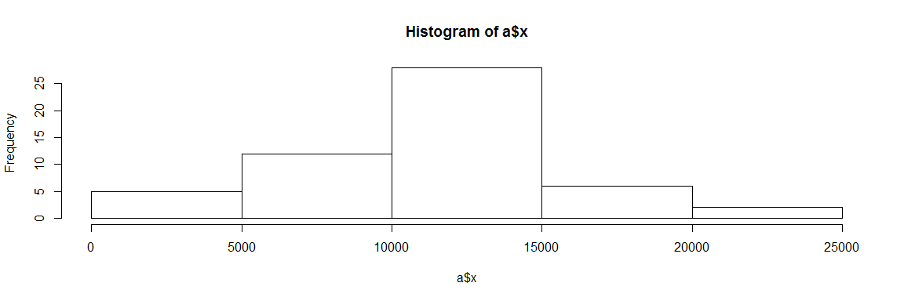
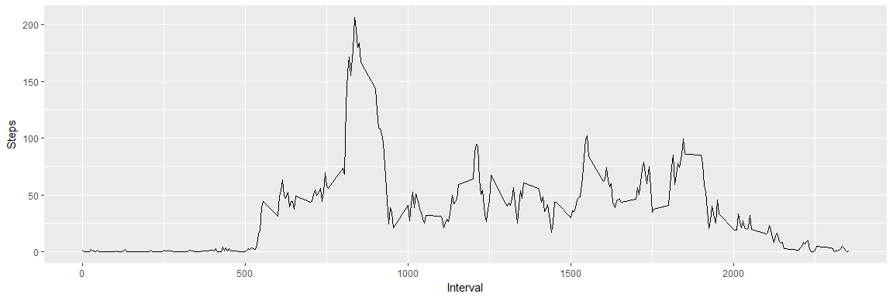
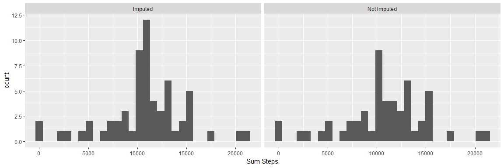
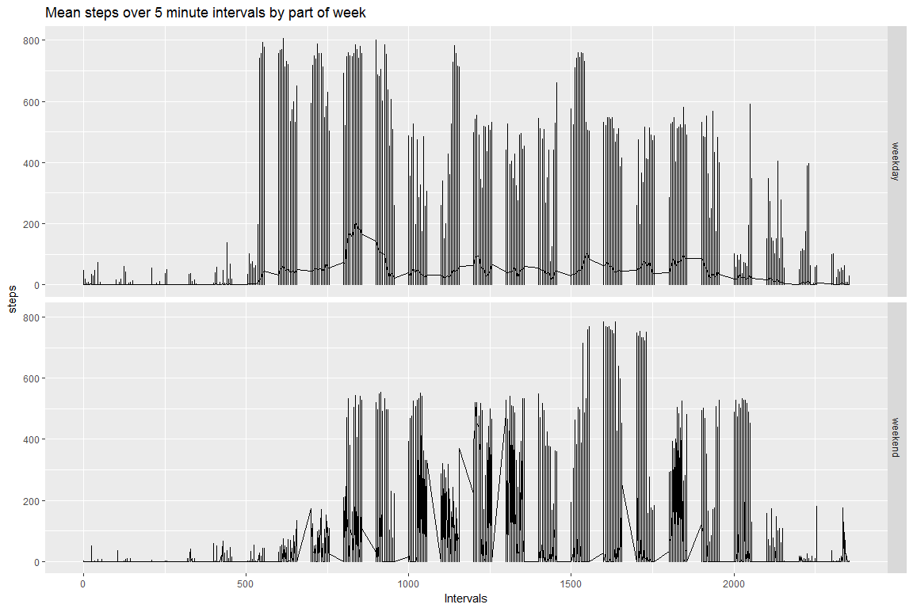

# Reproducible Research: Peer Assessment 1


## Loading and preprocessing the data

```r
library(ggplot2)
temp <- tempfile()
download.file("https://d396qusza40orc.cloudfront.net/repdata%2Fdata%2Factivity.zip",temp)
projData <- read.csv(unz(temp, "activity.csv"), sep = ",", header = TRUE, stringsAsFactors = FALSE)
unlink(temp)

projData$date <- as.Date(projData$date)
```


## What is mean total number of steps taken per day?
#### Make a histogram of the total number of steps taken each day

```r
a <- aggregate(projData$steps, by = list(projData$date), FUN = sum)
png("figure/dayStepHist.png")
hist(a$x)
dev.off()
```

```
## png 
##   2
```

```r
hist(a$x)
```

<!-- -->

```r
meanDaySteps <- mean(a$x, na.rm = TRUE)
```
The mean total number of steps is 10766.19


## What is the average daily activity pattern?
#### Make a time series plot (i.e. type = "l") of the 5-minute interval (x-axis) and the average number of steps taken, averaged across all days (y-axis)

```r
b <- aggregate(projData$steps, by = list(projData$interval), FUN = function(x) mean(x, na.rm = TRUE))
names(b) <- c("Interval", "Steps")
png("figure/meanStepsInterval.png")
qplot(Interval, Steps, data = b, geom = "line")
dev.off()
```

```
## png 
##   2
```

```r
qplot(Interval, Steps, data = b, geom = "line")
```

<!-- -->

#### Which 5-minute interval, on average across all the days in the dataset, contains the maximum number of steps?

```r
maxStepInterval <- b$Interval[b$Steps == max(b$Step, na.rm = TRUE)]
```
On average across all days, the interval with the max number of steps is 835

## Imputing missing values
#### Calculate and report the total number of missing values in the dataset (i.e. the total number of rows with NAs)

```r
totalNASteps <- sum(is.na(projData$steps))
totalNAs <- sum(is.na(projData))
```
The total NA values for step values is 2304 and the total NAs in the dataset are 2304 indicating that the only missing values are in the steps column.

#### Devise a strategy for filling in all of the missing values in the dataset. The strategy does not need to be sophisticated. For example, you could use the mean/median for that day, or the mean for that 5-minute interval, etc.

```r
c <- aggregate(projData$steps, by = list(projData$interval), FUN = function(x) median(x, na.rm = TRUE))
names(c) <- c("Interval","MedianSteps")

stepsNA <- is.na(projData$steps)

imputedProjData <- projData
for (record in 1:length(imputedProjData$interval)) {
  currentInterval <- imputedProjData$interval[record]
  currentSteps <- imputedProjData$steps[record]
  if (is.na(currentSteps)) {
    imputedProjData$steps[record] <- b$Steps[match(currentInterval, c$Interval)]

  }
}
sum(is.na(imputedProjData$steps))
```

```
## [1] 0
```

#### Create a new dataset that is equal to the original dataset but with the missing data filled in.
##### This guy -> imputedProjData

#### Make a histogram of the total number of steps taken each day and Calculate and report the mean and median total number of steps taken per day. Do these values differ from the estimates from the first part of the assignment? What is the impact of imputing missing data on the estimates of the total daily number of steps?

```r
a <- aggregate(projData$steps, by = list(projData$date), FUN = function(x) sum(x, rm.na = TRUE))
d <- aggregate(imputedProjData$steps, by = list(imputedProjData$date),
               FUN =  function(x) sum(x, rm.na = TRUE))
a$imputed <- "Not Imputed"
d$imputed <- "Imputed"
e <- rbind(a,d)
# e <- merge(a,d,by = "Group.1")
names(e) <- c("date","sumSteps","imputed")
png("figure/imputedDayStepsHist")
ggplot(e, aes(sumSteps)) + xlab("Sum Steps") + facet_wrap(~imputed) + geom_histogram()
```

```
## `stat_bin()` using `bins = 30`. Pick better value with `binwidth`.
```

```
## Warning: Removed 8 rows containing non-finite values (stat_bin).
```

```r
dev.off()
```

```
## png 
##   2
```

```r
ggplot(e, aes(sumSteps)) + xlab("Sum Steps") + facet_wrap(~imputed) + geom_histogram()
```

```
## `stat_bin()` using `bins = 30`. Pick better value with `binwidth`.
```

```
## Warning: Removed 8 rows containing non-finite values (stat_bin).
```

<!-- -->

```r
meanDailySteps <- mean(a$x, na.rm = TRUE)
medianDailySteps <- median(a$x, na.rm = TRUE)

meanImpDailySteps <- mean(d$x, na.rm = TRUE)
medianImpDailySteps <- median(d$x, na.rm = TRUE)
```
Mean Daily Steps Without Imputing: 1.0767189\times 10^{4}
Median Daily Steps Without Imputing: 10766

Mean Daily Steps With Imputing:1.0767189\times 10^{4}
Median Daily Steps With Imputing: 1.0767189\times 10^{4}
Imputing does not seem to significantly change the median or mean overall. However, it does contribute to higher central tendency as the histogram mid points are much higher after imputing.


## Are there differences in activity patterns between weekdays and weekends?
#### Create a new factor variable in the dataset with two levels – “weekday” and “weekend” indicating whether a given date is a weekday or weekend day.

```r
weekDay <- weekdays(as.Date(projData$date))
weekDay <- lapply(weekDay, FUN = function(x){
  if (x %in% c("Saturday","Sunday")) {
    return("weekend")
  }
  else {return("weekday")}
})
projData$partOfWeek <- as.factor(unlist(weekDay))
imputedProjData$partOfWeek <- as.factor(unlist(weekDay))
```


#### Make a panel plot containing a time series plot (i.e. type = "l") of the 5-minute interval (x-axis) and the average number of steps taken, averaged across all weekday days or weekend days (y-axis). See the README file in the GitHub repository to see an example of what this plot should look like using simulated data.

```r
meanInterval <- aggregate(imputedProjData$steps, by = list(imputedProjData$interval,
                  imputedProjData$partOfWeek), FUN = mean)
names(meanInterval) <- c("interval","partOfWeek","steps")
png("figure/partOfWeekSteps.png")
ggplot(imputedProjData, aes(interval,steps)) + xlab("Intervals") +
  ggtitle("Mean steps over 5 minute intervals by part of week") + facet_grid(partOfWeek~.) +
  geom_line()
dev.off()
```

```
## png 
##   2
```

```r
ggplot(imputedProjData, aes(interval,steps)) + xlab("Intervals") +
  ggtitle("Mean steps over 5 minute intervals by part of week") + facet_grid(partOfWeek~.) +
  geom_line()
```

<!-- -->
Weekday activity gets a consistent start and stays steady until a steady decline later in the day. On weekends, however, activity begins later in the day, takes longer to ramp up, and continues to climb steadily until dropping off more rapidly than weekdays later in the day.
